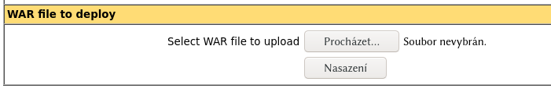

# Docker & Tomcat

To build the image, run inside this folder:

```
docker build -t mytomcat ./
```

To run it:

```
docker run --name tomcat --rm -p 8080:8080 mytomcat
```

To access the manager application, go to [http://localhost:8080/manager/html](http://localhost:8080/manager/html).

Use `admin` as a username and `super tajne heslo` as a password.

Here, you can deploy your own web application using the **WAR file to deploy** section:


