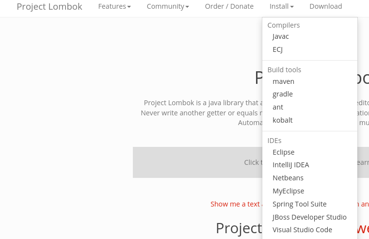

# Inversion of Control & Dependency Injection

## Terms and theory

### Inversion of Control

In traditional environments, the programmer has a complete control over the flow of the program from start
to end.

In IoC, there is a framework or encapsulating container responsible for the flow. Even the Servlet Container
introduced to you in the previous lecture is an IoC container. You might have noticed, that no main method
was implemented in the application. The container was responsible to accepting the requests and calling
the right filters and servlets.

### Dependency Injection

Dependency injection is on of the tools available to implement IoC. Traditionally, the programmer is responsible
for resource allocation, object creation and so on.

In DI, you just ask the framework or container to provide a dependency.

### Spring

Spring is a huge framework covering almost any area of programming, but at its core there is an IoC and DI
implementation.

Spring framework provides a unified API for many tasks (messaging, persistence, caching) and using IoC and DI
allow you to switch between underlying technologies often just by configuration and without any changes to the code.

There are some terms to keep in mind when working with Spring:

* bean - usually a singleton object managed by Spring and injected as a dependency
* component - generic type of bean, use service, repository, ... instead
* service - a bean containing some logic
* repository - a bean providing data access
* configuration - usually a class configuring services and providing beans in case they cannot be created automatically

More is described in the example project.

### Spring Boot

Spring Boot in addition to Spring Framework provides us with set of tools to simplify Java Application development.

Set of features quoted from the [official web](https://spring.io/projects/spring-boot):
* Create stand-alone Spring applications
* Embed Tomcat, Jetty or Undertow directly (no need to deploy WAR files)
* Provide opinionated 'starter' dependencies to simplify your build configuration
* Automatically configure Spring and 3rd party libraries whenever possible
* Provide production-ready features such as metrics, health checks, and externalized configuration
* Absolutely no code generation and no requirement for XML configuration

### Proxy objects

Proxy objects are an integral part of Spring and it is necessary to understand some of their limitations.

When you ask Spring to inject a dependency to a bean, you don't get the instance of the class you expect, but
a proxy object. This object wraps the methods so additional processing (based on annotations or XML configuration)
is possible. This means, however, that calling methods within the same class lacks this possibility, as the calls
are passed directly without the proxy object.

The most frequent case, when this causes problems is transaction handling:

```Java
@Transactional
public void saveUser(User user) {
	...
}

public void saveUsers(List<User> users) {
    users.stream.forEach(this::saveUser);
}
```

In this case, while calling `saveUser()` from another bean, the transaction is created as expected, but whe
you call `saveUsers()`, no transaction is created.

There are three ways to handle this problem:
1. add `@Transactional` to the `saveUsers()` method, if saving all users in one transaction is a viable option,
2. add another layer - a separate service containing only the `saveUser()` method and another using this one as a dependency
and providing single and multiple save possibilities,
3. programmatically retrieve the proxy for `this` and us it to call the transactional method.

### Boilerplate reduction & Lombok

In Java there is a lot of code that "has to be there", but it just floods our classes and makes it
harder to focus on the real problem. This is called **boilerplate code**. These are usually getters,
setters, constructors, `toString()`, `hashCode()` and `equals()` methods.

[Project Lombok](https://projectlombok.org/) provides many useful tools to reduce the unnecessary code
to minimum using a set of annotations. It is widely used in the example project.

### Slf4j

A de facto standard logging library. I mention it here just so you understand the `@Slf4j` Lombok annotation
used in the example project. It provides a `log` field you can use for logging.

### Project structure

On top of the Maven project structure (convention over configuration), Spring adds some more conventions. The only
one being used in our project is the `application.properties` file in the `src/main/resources` folder. Spring
automatically reads and applies configuration properties found in this file. There are [many other possibilities](https://docs.spring.io/spring-boot/docs/2.3.x/reference/html/spring-boot-features.html#boot-features-external-config) of configuration.

## Tasks

### Install Lombok into your IDE

1. Go to [Project Lombok](https://projectlombok.org/).
2. From the install menu select your IDE

3. Follow the installation instructions.

### Explore the sample project

The main class is `IocApp`, as you can see, it does nothing, but start the Spring. This is a standalone
Java application, there is no need to deploy it to any container, it starts an embedded Servlet Container and
we don't have to care about it. Run this as any other application from your IDE.

There are also two "traditional" Servlet API classes `IocFilter` and `IocServlet` implementing
the same logic as we did in the lecture on servlets.

Another web entry point is implemented in the `IocController` class.

The actual logic is implemented in the `IocServiceImpl` service class and the `FakeRepo` repository class. This is
a common pattern and best practice to have the REST, service and repo layers separated.

The `IocController` defines a dependency on the `IocService` interface. Spring automatically locates the implementation,
creates a bean of it and injects it into the controller.

Open all the classes and read the comments there to understand the implementation details.

### Run the application

After running the application, check the output in the console. As we have the debug logging enabled
you can see a verbose information about Spring operations. Look for all instances of `IocServlet`, `IocFilter`,
`IocController`, `IocService` and observe how the beans are being created and dependencies injected.

To see the results of our web endpoints, visit the following addresses:

* [http://localhost:8080/](http://localhost:8080/) - to access thre REST endpoint defined
in the `IocController`
* [http://localhost:8080/hello](http://localhost:8080/hello)
* [http://localhost:8080/hello?from=Ada](http://localhost:8080/hello?from=Ada)

Notice the missing Servlet Context URI prefix. Our application is still served by a Servlet Container,
but Spring configures it as a root conainer meaning the prefix is empty.

### Play with Spring

#### Dependency not found
1. Add a new service interface `IocService2` with a method of your choice, for example `String helloWorld()`.
2. Add this new interface as a dependency to the `IocController`.
3. Restart the application - it should fail, explore the log and find the information about a missing dependency.

#### Provide the missing dependency
1. Implement the `IocService2` interface in a new `IocService2Impl` class.
2. Start the application, it should fix the problem.

#### Use the new service
1. Add a new REST endpoint to the `IocController` calling the new `IocService2` method - don't forget
to give it a unique request mapping to prevent collision with our `IocServlet` and the existing endpoint
in the `IocController`. I use `/hw` in the link below.
2. Restart the application.
3. Visit http://localhost:8080/hw.

#### Missing configuration property
1. Comment out the `default-from` property in the `application.properties` file.
2. Restart the application.
3. It should fail - explore the log and find the information about a missing property.

#### Multiple implementations found
1. Uncomment the `default-from` property in the `application.properties` file.
2. Create new class `SecondImpl` implementing the `IocService` interface.
3. Start the application.
4. It should fail - explore the log and find the information about multiple implementations of the same interface.
5. Try solving the issue using the `@Primary` annotation
6. Try solving the issue using the `@Qualifier` and either the automatically generated bean names or provide your preferred
names in the `@Service` annotations.
